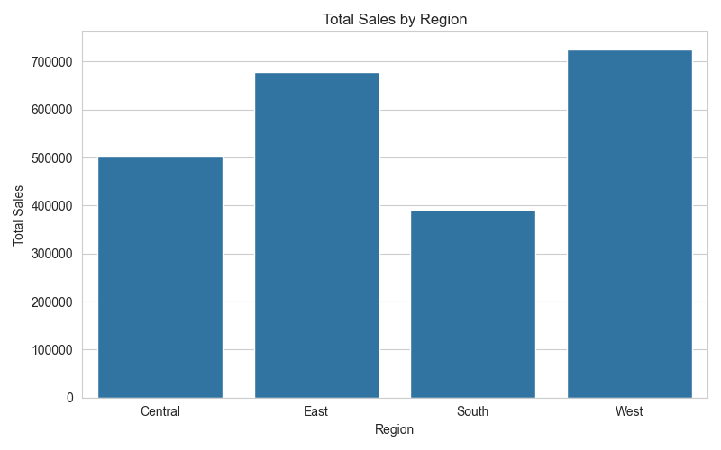
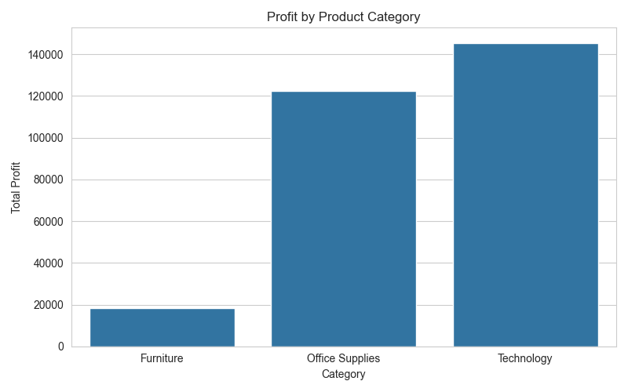
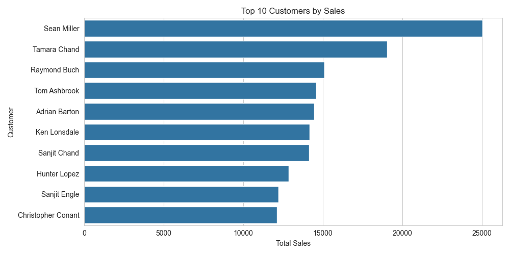
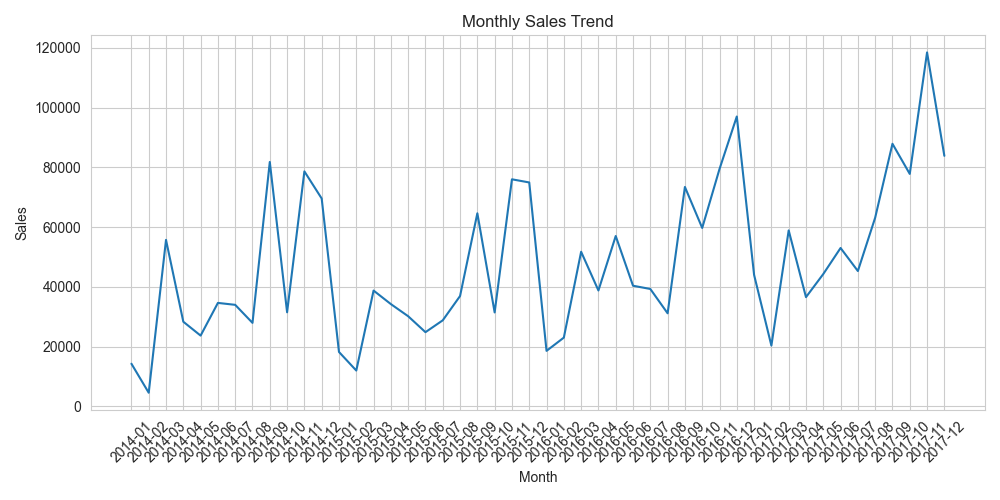
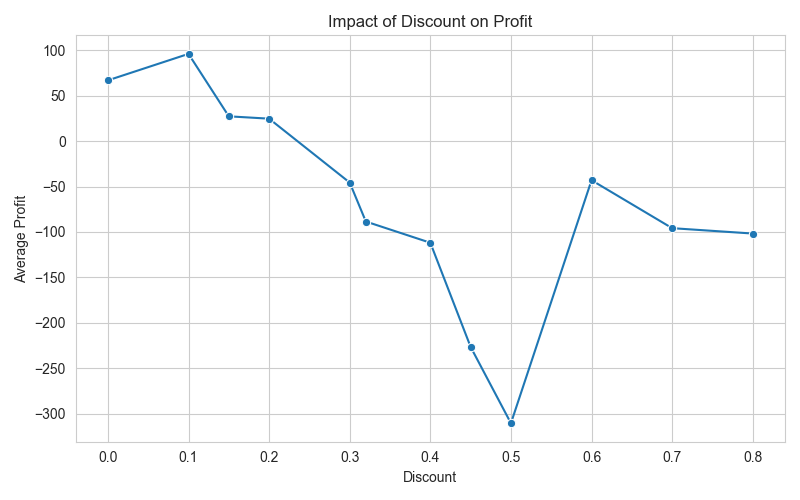

# 📊 Sales Analysis with Python, SQL & Data Visualization

<p align="center">
  
</p>

<p align="center">


</p>

---

# 📖 Project Overview

This project demonstrates an **end-to-end sales data analysis workflow** using **Python**, **Pandas**, **SQLite**, **SQL**, **Matplotlib**, and **Seaborn**.

The notebook follows a real-world Data Analytics pipeline—from importing raw sales data to cleaning, SQL querying, KPI generation, and visual storytelling through charts.

The goal is to transform transactional sales records into actionable business insights that support data-driven decision-making.

---

# ✨ Project Highlights

- 📥 Import raw sales data
- 🧹 Clean and preprocess the dataset
- 📅 Convert and analyze date fields
- 🗃 Store data in SQLite
- 🧮 Perform SQL-based business analysis
- 📊 Build insightful visualizations
- 📈 Generate key business KPIs
- 💡 Extract actionable business insights

---

# 📑 Table of Contents

- [Project Overview](#-project-overview)
- [Dataset](#-dataset)
- [Technologies Used](#-technologies-used)
- [Project Workflow](#-project-workflow)
- [Data Cleaning](#-data-cleaning)
- [SQL Analysis](#-sql-analysis)
- [Key Performance Indicators](#-key-performance-indicators)
- [Visualizations](#-visualizations)
- [Business Insights](#-business-insights)
- [Project Structure](#-project-structure)
- [Installation](#-installation)
- [Future Improvements](#-future-improvements)
- [Author](#-author)

---

# 📂 Dataset

The project uses a retail sales dataset containing transactional information such as:

| Feature | Description |
|----------|-------------|
| Order ID | Unique order identifier |
| Order Date | Date of purchase |
| Ship Date | Shipping date |
| Customer Name | Customer information |
| Segment | Customer segment |
| Product Name | Purchased product |
| Category | Product category |
| Sub-Category | Product subcategory |
| Region | Sales region |
| Sales | Revenue generated |
| Quantity | Units sold |
| Discount | Discount applied |
| Profit | Profit earned |

---

# 🛠 Technologies Used

| Technology | Purpose |
|------------|---------|
| Python | Programming Language |
| Pandas | Data Cleaning & Analysis |
| NumPy | Numerical Computing |
| SQLite | SQL Database |
| SQL | Business Queries |
| Matplotlib | Data Visualization |
| Seaborn | Statistical Visualization |
| Jupyter Notebook | Development Environment |

---

# 🔄 Project Workflow

```text
                    Raw Sales CSV
                          │
                          ▼
                Data Inspection & EDA
                          │
                          ▼
                   Data Cleaning
                          │
                          ▼
               Feature Engineering
                          │
                          ▼
              Export Clean Dataset
                          │
                          ▼
              SQLite Database Setup
                          │
                          ▼
                 SQL Business Queries
                          │
                          ▼
              KPI & Trend Analysis
                          │
                          ▼
                 Data Visualization
                          │
                          ▼
                 Business Insights
```

---

# 🧹 Data Cleaning

The notebook includes several preprocessing steps to improve data quality.

### ✔ Column Standardization

- Converted column names to lowercase
- Replaced spaces with underscores
- Improved naming consistency

Example:

```python
df.columns = (
    df.columns
      .str.lower()
      .str.replace(" ", "_")
)
```

---

### ✔ Date Conversion

Converted date columns into datetime format for:

- Monthly analysis
- Time-series trends
- Date filtering

---

### ✔ Data Validation

Performed checks for:

- Missing values
- Data types
- Dataset dimensions
- Duplicate records
- Summary statistics

---

### ✔ Export Clean Dataset

The cleaned dataset is exported for future analysis.

---

# 🗄 SQL Analysis

After cleaning, the dataset is loaded into a SQLite database, allowing SQL queries to answer common business questions.

The notebook performs analyses including:

- Total Sales
- Total Profit
- Sales by Region
- Sales by Category
- Monthly Sales Trends
- Top Customers
- Discount Impact on Profit

Example SQL query:

```sql
SELECT
    region,
    SUM(sales) AS total_sales
FROM sales
GROUP BY region
ORDER BY total_sales DESC;
```

---

# 📊 Key Performance Indicators

The notebook calculates important business metrics including:

- 💰 Total Sales
- 📈 Total Profit
- 📦 Total Orders
- 🛒 Average Discount
- 👥 Top Customers
- 🌍 Best Performing Region
- 📅 Monthly Sales Trends

These KPIs provide a quick overview of business performance.

---

# 📈 Visualizations

## 🌍 Regional Sales Performance

<p align="center">

</p>

Compares revenue generated across different sales regions.

---

## 📦 Category Performance

<p align="center">

</p>

Highlights sales and profitability by product category.

---

## 👥 Top Customers

<p align="center">

</p>

Displays the highest revenue-generating customers.

---

## 📅 Monthly Sales Trend

<p align="center">

</p>

Illustrates how sales evolve over time.

---

## 💰 Discount vs Profit

<p align="center">

</p>

Shows the relationship between discounts and profitability.

---

# 💡 Business Insights

The analysis helps answer several important business questions:

- Which region generates the highest sales?
- Which product category contributes the most revenue?
- Which customers generate the most income?
- How do sales fluctuate throughout the year?
- What effect do discounts have on profitability?
- Which areas present opportunities for business improvement?

---

# 🎯 Skills Demonstrated

This project showcases practical skills in:

- Data Cleaning
- Exploratory Data Analysis (EDA)
- SQL Querying
- SQLite Database Management
- Business Analytics
- KPI Reporting
- Time-Series Analysis
- Data Visualization
- Python Programming
- Storytelling with Data

---

# 📁 Project Structure

```text
sales-analysis/

│
├── data/
│   ├── superstore_sales.csv
│   └── clean_superstore_sales.csv
│
├── notebooks/
│   └── sales_analysis_main.ipynb
│
├── images/
│   ├── dashboard_preview.png
│   ├── regional_sales.png
│   ├── category_performance.png
│   ├── top_customers.png
│   ├── monthly_sales.png
│   └── discount_profit.png
│
├── README.md
├── requirements.txt
└── LICENSE
```

---

# ⚙ Installation

Clone the repository:

```bash
git clone https://github.com/<your-github-username>/sales-analysis.git
```

Move into the project directory:

```bash
cd sales-analysis
```

Install the required packages:

```bash
pip install -r requirements.txt
```

Launch Jupyter Notebook:

```bash
jupyter notebook
```

Open:

```text
notebooks/sales_analysis_main.ipynb
```

---

# 📦 Requirements

```
pandas
numpy
matplotlib
seaborn
sqlite3
jupyter
```

---

# 🚀 Future Improvements

Possible enhancements include:

- Interactive Plotly dashboards
- Streamlit web application
- Power BI dashboard
- Tableau dashboard
- Sales forecasting using Machine Learning
- Customer segmentation
- Profit prediction
- Geographic sales mapping
- Automated reporting

---

# 🤝 Contributing

Contributions are welcome!

1. Fork the repository.
2. Create a feature branch.

```bash
git checkout -b feature-name
```

3. Commit your changes.

```bash
git commit -m "Add new feature"
```

4. Push your branch.

```bash
git push origin feature-name
```

5. Open a Pull Request.

---

# 📜 License

This project is licensed under the **MIT License**.

Feel free to use, modify, and share this project for educational and professional purposes.

---

# ⭐ Support

If you found this project useful or learned something from it, please consider giving the repository a **⭐ Star**.

It helps others discover the project and supports future open-source work.

<p align="center">

### Thank you for visiting this project! 🚀

</p>

**Mubarik Wusa Manga**

GitHub: https://github.com/MaWusaM

LinkedIn: https://linkedin.com/in/Mubarik-Wusa-Manga-5439911b4 

---

